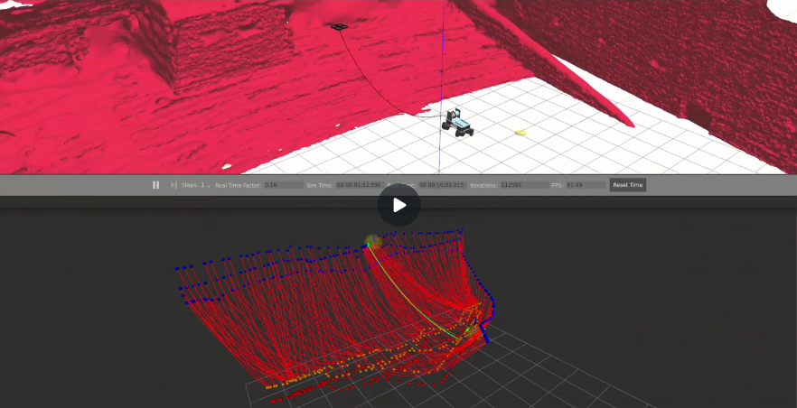
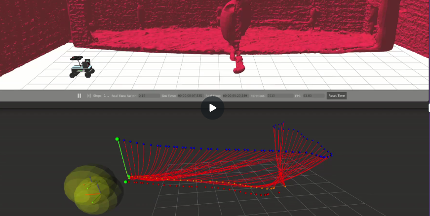

<div align="center">
<h1>Coordinador de trayectoria para un sistema robótico  marsupial UAV-UGV con cable de alimentación de longitud variable</h1>
</div>

# Índice de contenido

1. [Introducción](#introducción)
2. [Requisitos previos](#requisitos-previos)
3. [Experimentos realizados](#experimentos-realizados)
   - [Abrir terminal (en contenedor)](#abrir-terminal-en-contenedor)
   - [Lanzamiento de experimentos](#lanzamiento-de-experimentos)
     - [optimized_path_teatro_wall_opt_r.yaml - N=0 – LH Fijo - Por tiempo](#optimized_path_teatro_wall_opt_ryaml---n0--lh-fijo---por-tiempo)
     - [teatro_mission.yaml - N=0 – LH Fijo - Por tiempo](#teatromissionyaml---n0--lh-fijo---por-tiempo)
     - [optimized_path_teatro_wall_opt_r.yaml - LH Adaptative](#optimized_path_teatro_wall_opt_ryaml---lh-adaptative)
     - [teatro_mission.yaml - LH Adaptative](#teatro_mission.yaml---lh-adaptative)


---

# Introducción

El objetivo de este trabajo es implementar un esquema de control modular que permita a cada miembro del sistema robótico marsupial seguir su trayectoria correspondiente. Posteriormente, se diseña un algoritmo de coordinación durante el seguimiento de trayectorias de forma que ambos vehículos: terrestre y aéreo, sigan el mismo punto correspondiente a su trayectoria, evaluando el progreso de cada vehículo dentro de la misma mediante "índices de waypoints".

Para ello, se hace necesaria la implementación de los siguientes módulos dentro del ecosistema de ROS2:

- **Visualizador en RViz2**: representa todos los waypoints junto con las catenarias que forma el cable en cada punto de la trayectoria. Además, resalta en color verde los objetivos perseguidos por cada elemento del sistema en cada instante de tiempo.
- **Generador de referencias**: se implementa un Pure Pursuit para cada vehículo dentro del sistema marsupial. Mediante la publicación en tópicos de ROS, se informa al resto de nodos acerca del "índice de waypoint" al que se dirige cada miembro dentro del sistema y de la lookahead distance establecida.
- **Controladores individuales**: calculan la dirección a la que deben dirigirse UAV y UGV, estableciendo la velocidad calculada por el módulo Coordinador del sistema. Para el caso del cable (tether) se utiliza un control PID (Proporcional, Integral, Derivativo) que garantiza que la longitud de cable siga en todo momento la longitud de referencia establecida por el Coordinador y verificada por el controlador individual.
- **Coordinador del sistema**: calcula las velocidades adecuadas para la sincronización del vehículo terrestre y aéreo durante el seguimiento de la trayectoria.

Todos los módulos anteriores y la manera en la que se relacionan con el sistema se detalla en el siguiente diagrama:

<div align="center">
  
</div>


# Requisitos previos
Para preparar el entorno de simulación, es necesario disponer de un ordenador con el sistema operativo **Linux**, y que tenga instalado `Docker` junto con `git` en el sistema. Después solo se deben seguir una serie de pasos para disponer el mismo contenedor empleado durante la ejecución de experimentos:

1. Clonar el repositorio de partida del paquete [`marsupial_simulator_ros2`](https://github.com/roblopcor/marsupial_simulator_ros2.git)
, dirigirse a la carpeta principal y construir desde ese directorio la imagen `marsupial_image`:
```bash
docker build -t marsupial_image .
```

2. Crear un contenedor `marsupial_container` con acceso a la GPU, soporte para interfaz X11 y un volumen montado de forma que se comparta la carpeta local `/home/roberto/docker` con los paquetes instalados dentro de la ruta en el contenedor `/home/upo/marsupial/src`. Estas dos rutas pueden cambiarse de la forma que mejor se adapte al usuario:
```bash
sudo docker run -it \
  --gpus all \
  --runtime=nvidia \
  --env DISPLAY=$DISPLAY \
  --env NVIDIA_DRIVER_CAPABILITIES=all \
  --env QT_X11_NO_MITSHM=1 \
  --volume /tmp/.X11-unix:/tmp/.X11-unix \
  --volume /home/roberto/docker:/home/upo/marsupial/src \ 
  --device /dev/dri \
  --name marsupial_container \
  marsupial_image
```

3. Abrir un terminal dentro del contenedor:
```bash
docker start marsupial_container 
xhost +local:docker 
docker exec -it marsupial_container bash
```

3. Instalar algunas dependencias adicionales dentro del contenedor como: [`pycatenary`](https://github.com/tridelat/pycatenary.git) y [`matplotlib`](https://github.com/matplotlib/matplotlib.git)
```bash
pip install pycatenary
```
```bash
pip install matplotlib
```

4. Dentro de la carpeta `src` del contenedor, clonar el paquete coordinador [`ros2_marsupial_coordinator`](https://github.com/roblopcor/ros2_marsupial_coordinator)
```bash
cd /home/upo/marsupial/src
git clone https://github.com/roblopcor/ros2_marsupial_coordinator
```

5. Ajustar la longitud máxima de la cuerda que aparece por defecto según las características del experimento que se desee realizar. Para ello se modifica dentro del archivo `/marsupial_simulator_ros2/models/tether/tether.sdf.jinja` la línea 4:
```bash
    {#- Initial: 123; set at 203 for 20 m tether, 101 for 10 m , 162 for 16 m -#}
```
5. Ejecutar los cambios realizados:
```bash
python3 /home/upo/marsupial/src/marsupial_simulator_ros2/scripts/jinja_gen.py /home/upo/marsupial/src/marsupial_simulator_ros2/models/tether/tether.sdf.jinja /home/upo/marsupial/src/marsupial_simulator_ros2/models/tether 
```

# Experimentos realizados

## Abrir terminal (en contenedor)

Iniciar el contenedor y conceder permisos si no se ha realizado antes:
```bash
docker start marsupial_container
xhost +local:docker
docker exec -it marsupial_container bash
```

Se cargan las variables de entorno para cada terminal abierto:
```bash
source /opt/ros/humble/setup.bash
colcon build 
source install/setup.bash 
```

## Lanzamiento de experimentos

Se ajusta la longitud máxima de la cuerda en 10 m para la realización de los experimentos.

En caso de que el dron no haya sido desplegado en los primeros segundos tras cargar la simulación, se despliega manualmente:
```bash
ros2 topic pub /sjtu_drone/takeoff std_msgs/msg/Empty {} --once 
```

### Trayectoria 1 - "optimized_path_teatro_wall_opt_r.yaml" - N=0 – LH Fijo - Por tiempo (waypoint de sincronización)
1º Lanzar entorno de simulación + Pure Pursuit + Visualizador + Despegue Dron 
```bash
ros2 launch ros2_marsupial_coordinator trajectory_follower_fixed_LH.launch.py world:=theatre.world pos_x:=7.8 pos_y:=-1.13 pos_z:=0.0 yaml_filename:=optimized_path_teatro_wall_opt_r.yaml 
```
2º Escoger el método coordinador 
```bash
ros2 run ros2_marsupial_coordinator future_coordinator.py --ros-args -p yaml_filename:=optimized_path_teatro_wall_opt_r.yaml -p N:=0 
```
3º Ejecutar controladores individuales 
```bash
ros2 launch ros2_marsupial_coordinator controllers.launch.py 
```
[](https://youtu.be/oFyRatBKpac)

### Trayectoria 2 - "teatro_mission.yaml" - N=0 – LH Fijo - Por tiempo (waypoint de sincronización)

1º Lanzar entorno de simulación + Pure Pursuit + Visualizador + Despegue Dron 
```bash
ros2 launch ros2_marsupial_coordinator trajectory_follower_fixed_LH.launch.py world:=theatre.world pos_x:=-0.5 pos_y:=-1.52 pos_z:=0.0 yaml_filename:=teatro_mission.yaml 
```
2º Escoger el método coordinador 
```bash
ros2 run ros2_marsupial_coordinator future_coordinator.py --ros-args -p yaml_filename:=teatro_mission.yaml -p N:=0 
```
3º Ejecutar controladores individuales 
```bash
ros2 launch ros2_marsupial_coordinator controllers.launch.py
```
[](https://youtu.be/kdYnqbq4_UQ)


### Trayectoria 1 - "optimized_path_teatro_wall_opt_r.yaml" - LH Adaptative – Por exceso de waypoint (ajuste fijo de velocidades)

1º Lanzar entorno de simulación + Pure Pursuit + Visualizador + Despegue Dron 
```bash
ros2 launch ros2_marsupial_coordinator trajectory_follower_adaptative_LH.launch.py world:=theatre.world pos_x:=7.8 pos_y:=-1.13 pos_z:=0.0 yaml_filename:=optimized_path_teatro_wall_opt_r.yaml 
 ```
2º Escoger el método coordinador 
```bash
ros2 run ros2_marsupial_coordinator coordinator.py 
```
3º Ejecutar controladores individuales 
```bash
ros2 launch ros2_marsupial_coordinator controllers.launch.py 
```

[](https://youtu.be/FU3ehg03aek)
### Trayectoria 2 - "teatro_mission.yaml" - LH Adaptative – Por exceso de waypoint (ajuste fijo de velocidades)
1º Lanzar entorno de simulación + Pure Pursuit + Visualizador + Despegue Dron 
```bash
ros2 launch ros2_marsupial_coordinator trajectory_follower_adaptative_LH.launch.py world:=theatre.world pos_x:=-0.5 pos_y:=-1.52 pos_z:=0.0 yaml_filename:=teatro_mission.yaml 
```
2º Escoger el método coordinador 
```bash
ros2 run ros2_marsupial_coordinator coordinator.py 
```
3º Ejecutar controladores individuales 
```bash
ros2 launch ros2_marsupial_coordinator controllers.launch.py  
```
